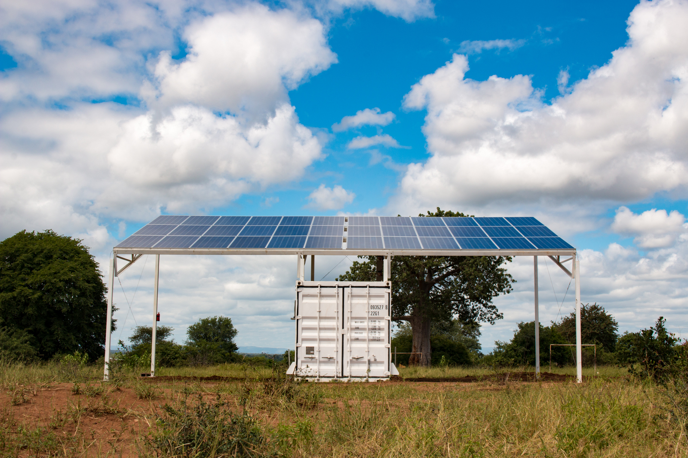
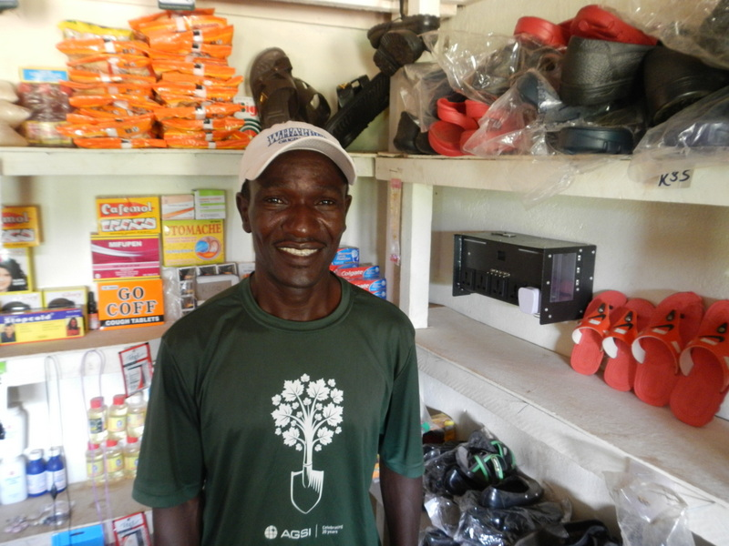

[Standard Microgrid (SMG)](http://standardmicrogrid.com) is a big inspiration behind this blog. It's a great example of how rethinking energy distribution can enable everyone to have access to power. SMG targets island and isolated rural communities that haven't had power before, starting in Zambia but with ambition across Sub-Saharan Africa (SSA).

> Fully contained within a 20' shipping container, the 10kW micro power utility can be deployed in three days, with the capacity to deliver power to upwards of 150 homes. - [standardmicrogrid.com](http://standardmicrogrid.com)

So far this looks like, well, a fairly standard solar microgrid. But SMG thinks more like a product company than a utility or an NGO. They're looking to set a new standard.

SMG provides *high-amperage* power to areas that either have no power, or low-wattage solar systems that only provide LED lighting or phone charging.  High-amperage power enables new uses that create economic power: fridges, power tools, sewing machines.

Usually, high-amperage power is too expensive an undertaking and not cost-effective for these communities. SMG has shown it's possible because they rethought a few core assumptions:

> Rather than paying a utility company for electricity by the kilowatt unit, a local Microgrid manger is provided simple tools to manage the grid and distribute subscription credit to connected community members. - [raeng.org.uk](https://www.raeng.org.uk/grants-and-prizes/international-research-and-collaborations/africa-prize/current-and-recent-awardees/2016)

## Subscription Credit

If you grew up with electricity in your home, you probably expect all the plugs to provide power whenever you plug anything in.  SMG targets people without the assumption of on-demand power. They sell power subscriptions for specific times and devices. 

This ripples into other advantages in their business model.

## Return on capital

> Power generated is stored in batteries and supply and demand is balanced to ensure reliability and eliminate electricity waste. - [raeng.org.uk](https://www.raeng.org.uk/grants-and-prizes/international-research-and-collaborations/africa-prize/current-and-recent-awardees/2016)

One of the biggest costs in solar power provision is from amortizing the batteries. With these subscriptions, power demand becomes more predictable. This allows a variety of optimizations, from revenue and yield optimization similar to airline tickets, through to designing services that use the batteries more effectively.  All of these, combined with other technologies,like digital AC, enable SMG to make high-amperage power affordable in these communities.

## Fast deployment - technically, financially and operationally

> Enabling seamless, remote demand side control of the grid is the Standard Microgrid Switch. Used in conjunction with the Microgrid Manager Mobile App, the Switch provides the ability to sell prepaid energy services, report energy use and misuse, and prevent over-utilization of the grid. The entire system is fully automated and can be managed remotely from anywhere in the world.

Technically, the system can deploy quickly. Power subscriptions are sold and managed by a local agent using a phone app, so they directly create local employment on top of enabling new businesses and industry to emerge.

## Community support

SMG has deployed in three different areas in Zambia, which is a great start. They've shown they
can help a community rise. 

It's not uncommon to see local leaders mobilize a community to pay for some form of infrastructure, whether it's a toilet at the church, or pulling a power line from the grid. SMG is well-position to sell into this kind of initiative, since the local community doesn't pay for the upfront capital cost.

## Government approval

That said, from what I've seen in SSA, if government approval is needed, that becomes a clear bottleneck for growth. Navigating the government in each country, even each county, provides a new learning challenge.  You never know if or how long a deal will take, which means you need to work on lots of deals at once.

## The factors of growth

So even with fast deployment and high capital efficiency, I wonder how difficult it is to manage their pipeline.  I'd guess there's a tension between having a wide pipeline of different communities, and of having the capital available to deploy if they all become ready.
